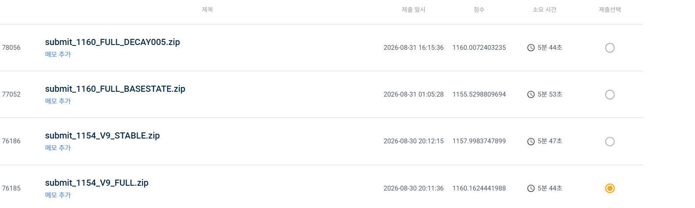
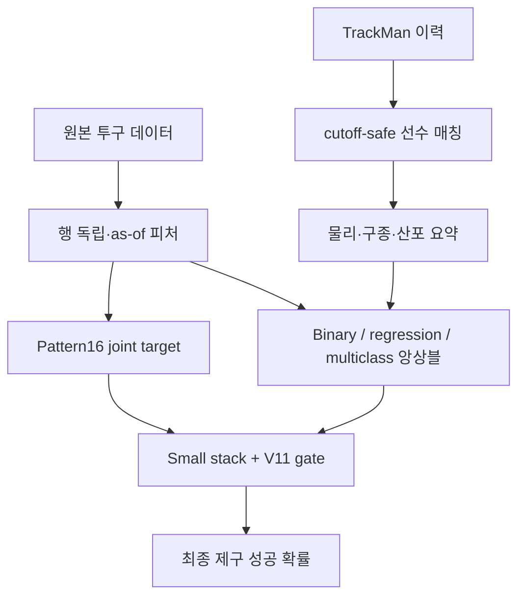

# KBO 투구 제구 성공 확률 예측

> 한 투구가 제구에 성공할 확률을 예측한 팀 프로젝트. 데이터 이해부터 검증 체계, TrackMan 결합, 보조 타깃, 앙상블을 처음부터 구축해 Public LB **1160.1624**를 기록했습니다.


## 한눈에 보기

- 문제: 현재 행에 주어진 경기·선수 정보만으로 `control_success` 확률 예측
- 데이터: 학습 약 **147만 투구**, 평가 약 **24.6만 투구**, TrackMan 이력 약 **179만 투구**
- 핵심 전환: 선수를 직접 맞히는 문제에서 **현재 한 공에서 일어난 사건 구조**를 모델링하는 문제로 관점 변경
- 최종 구조: 이진 앙상블 + TrackMan/선수 이력 + Pattern16 + Joint6/Futures 보정 + disagreement gate
- 결과: `1070.1118 → 1089.9134 → 1136.8054 → 1140.4990 → 1154.8135 → 1157.9984 → 1160.1624`
- 최종 순위: 약 **65위** (사용자 기록 기준)

## 0에서 1160까지

기성 baseline을 받아 숫자만 조정한 프로젝트가 아니다. 원본 스키마와 라벨을 분석하고, 시간 누수를 막는 as-of 피처를 만들고, 서로 다른 모델과 타깃을 조립하는 파이프라인을 처음부터 쌓았다.

| 단계 | Public LB | 무엇이 달라졌나 |
|---|---:|---|
| 첫 강한 앙상블 | 1070.1118 | 선수 이력의 Marcel prior와 GBDT/MLP 앙상블 |
| 보조 라벨·링크 다양화 | 1089.9134 | 실패 유형 복원, 다중분류, squared-loss 모델 추가 |
| 상태별 확률 보정 | 1136.8054 | Futures·팀·base/out 수준 보정과 교차검증 |
| 피처 프레임·TrackMan | 1140.4990 | 정밀 매칭, 투수별 물리·구종·산포 요약, 80/101열 프레임 |
| Pattern16 | 1154.8135 | 4개 사건의 16가지 joint target을 예측해 control 확률로 환산 |
| Small stack | 1157.9984 | Joint6 Cat/XGB와 Futures 가중 축을 안정적으로 결합 |
| V11 FULL | **1160.1624** | P48 disagreement gate를 더해 행별 보정 강도 조절 |

초기 점수와 중간 점수는 보관된 팀 실측 기록, 마지막 세 점수는 제출 기록을 기준으로 정리했다. 자세한 근거는 [실험 이력](docs/EXPERIMENTS.md)에 있다.

<p align="center">
  
</p>

## 문제를 푼 방식



### 1. 선수 이력은 미래를 보지 않게 만들었다

투수와 타자의 누적 성공률, 최근 1/3/5경기 폼, 구종 비중을 해당 투구 이전 기록만 사용해 계산했다. 표본이 적은 선수는 리그 평균으로 수축하고, Marcel식 prior를 모델의 초기 확률로 사용했다.

### 2. TrackMan은 현재 공의 정답이 아니라 과거 프로필로 사용했다

공식 데이터만으로 선수 ID를 매칭하고, 평가 시점 이전의 구속·회전·무브먼트·릴리스·구종 분포를 선수 단위로 요약했다. 엄격한 투구 단위 조인은 정밀도는 높지만 1:1 커버리지가 약 70%여서, 배포에는 커버리지가 높은 prior-profile과 산포 요약을 사용했다. 자세한 내용은 [TrackMan 통합](docs/TRACKMAN.md)을 참고한다.

### 3. 정답을 하나의 0/1로만 보지 않았다

누적 event counter에서 `reverse`, `middle`, `ball`, `strike`를 복원했다. 네 사건의 존재 여부를 4비트로 묶어 16개 joint class를 만들고, 각 class에서의 성공 확률을 곱해 최종 확률로 바꿨다.

```text
X ──> P(pattern = 0..15) ──> Σ P(pattern=k|X) · P(success|pattern=k)
```

Pattern16 단독 모델은 이진 모델보다 약했지만, 강한 예측과 **낮은 가중치로 결합했을 때 +5.46**, 4/5 fold 양수였다. 이 프로젝트의 가장 큰 모델링 교훈은 “좋은 독립축은 단독 점수가 아니라 강한 baseline 위의 marginal gain으로 판단한다”는 것이다.

### 4. 평균 gain보다 전달 안정성을 우선했다

2022·2023에서 구조와 가중치를 선택하고 2024를 마지막 seal로 사용했다. 후보는 평균뿐 아니라 양수 fold 수, worst fold, 강한 FULL 대비 marginal gain을 함께 통과해야 했다. 이 규율이 없었다면 base-state와 temporal decay처럼 로컬에서는 좋아 보였지만 실제 LB에서 떨어진 후보를 채택했을 것이다.

## 저장소 구성

```text
.
├── src/pitch_control/       # 공개용으로 다시 작성한 핵심 로직
├── scripts/run_demo.py      # 합성 데이터 end-to-end 데모
├── tests/                   # Pattern16·metric·행 독립성 테스트
├── results/                 # 검증된 점수 이력과 대표 실험 요약
├── docs/                    # 방법론, TrackMan, 검증, 실패 실험
└── assets/                  # 리더보드 증빙 이미지
```

## 실행

대회 데이터와 학습 모델은 재배포하지 않는다. 아래 데모는 동일한 인터페이스를 합성 데이터로 보여준다.

```bash
python -m venv .venv
source .venv/bin/activate       # Windows: .venv\Scripts\activate
pip install -e .
python scripts/run_demo.py
python -m unittest discover -s tests -v
```

## 무엇을 공개하지 않았나

- 대회 원본 데이터와 TrackMan 원본
- 학습된 모델 가중치와 실제 제출 ZIP
- 팀원이 작성한 production 코드를 그대로 복사한 파일
- 평가 행끼리 정보를 공유하는 규정 위반 로직

이 저장소의 코드는 포트폴리오 설명과 핵심 개념 재현을 위해 새로 작성한 축약판이다. 전체 production 시스템은 수백 개의 실험 스크립트와 모델 아티팩트로 구성돼 있었다.

## 더 읽기

- [실험 이력과 점수 상승](docs/EXPERIMENTS.md)
- [시간 누수 방지와 검증 규율](docs/VALIDATION.md)
- [TrackMan 매칭과 물리 피처](docs/TRACKMAN.md)
- [실패 실험에서 배운 점](docs/FAILURES.md)
- [면접·포트폴리오용 요약](docs/PORTFOLIO.md)

## 라이선스

공개용으로 다시 작성한 코드는 MIT License를 따른다. 데이터와 원래 팀 아티팩트에는 이 라이선스가 적용되지 않는다.
